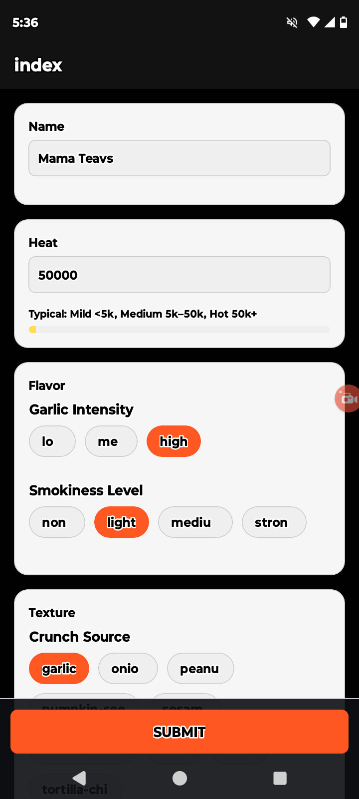
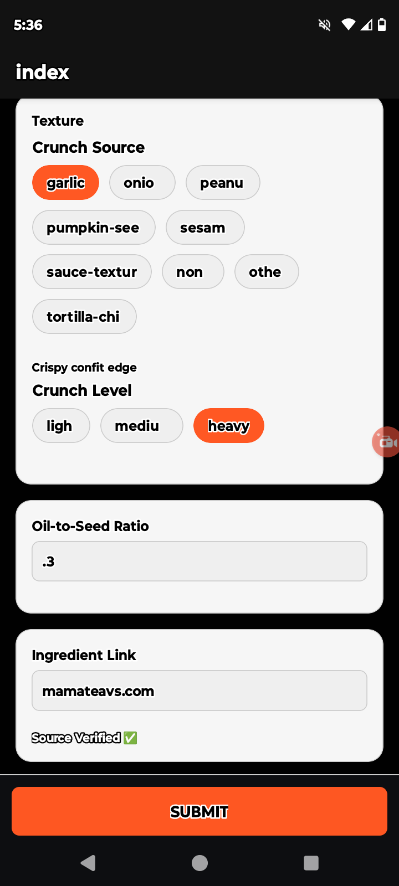
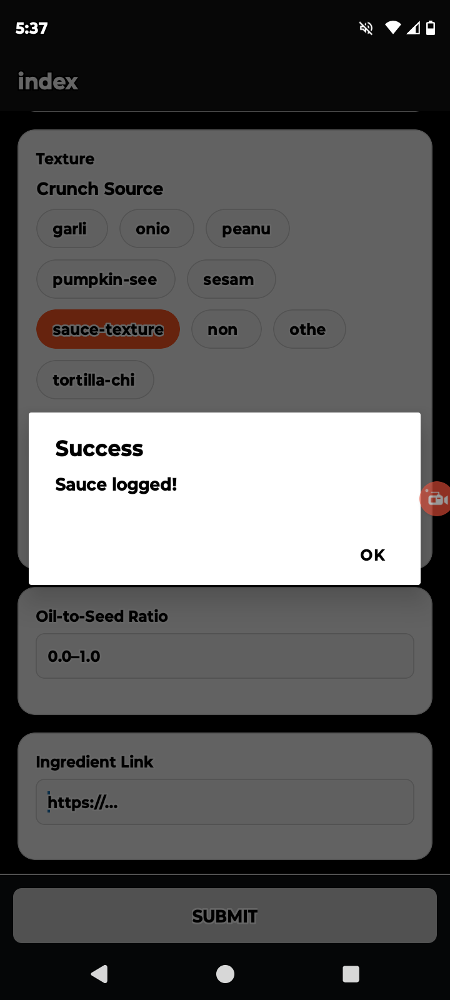
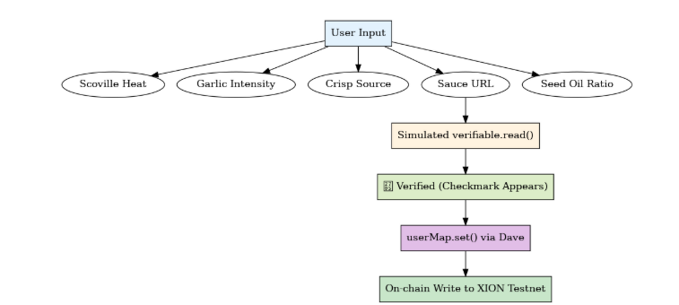

# Proof of Scoville

**Live Demo App:** [Launch on Expo Go](https://expo.dev/preview/update?message=Checkpoint+2+public+release+%28sdk+runtime%29&updateRuntimeVersion=exposdk%3A53.0.0&createdAt=2025-08-24T23%3A45%3A50.035Z&slug=exp&projectId=b31bbdee-3062-4d48-9d06-649d02e82d26&group=015840dd-72ad-47b1-ab54-b5c5ca9ee9fa)  
**Demo Video:** [Watch on YouTube](https://youtube.com/shorts/etYvSHW92t0?si=g1jiI5lJGi7Uu5Vw)

---

## 🔍 Project Purpose 

**Proof of Scoville** is a mobile-first demo app that explores how verifiable internet data and on-chain logic can support decentralized food safety, trust, and community engagement.

Built for Checkpoint 2 of the XION Hackathon, this app simulates a world in which artisanal hot sauces and condiments are verified, rated, and recorded transparently. Users enter structured sauce data (like Scoville heat, garlic intensity, and crisp source), then verify the sauce's origin via a simulated verifiable.read() implementation. Once verified, the entry is committed on-chain using Dave's `userMap.set()`.

This project prioritizes working functionality over visual polish at this stage. The design is minimal, but the core data flow—from user input to verified source to on-chain write—is tested and working on both iOS and Android devices via Expo Go.

---

## 🎯 Addressing the Hackathon Problem Statement

**Proof of Scoville** simulates a decentralized way to verify food product claims (like origin or ingredient sourcing) and record them on-chain — aligning directly with the hackathon challenge to build mobile apps that use verifiable data to create trust in new ways.

The app demonstrates how verifiable internet data (via a simulated `verifiable.read()`) and on-chain commitment (`userMap.set()` using the Dave SDK) can enable new trust layers in cultural and consumer domains — here, applied to hot sauces and culinary provenance.

It’s designed for builders exploring zkTLS, verifiable data, and decentralized apps. While playful in tone, it showcases how trust infrastructure can be applied beyond financial or institutional contexts — in this case, helping users verify and record product data in a transparent, structured way.

### Target Users
- Hackathon participants and judges evaluating zk data flows
- Developers exploring Dave SDK and XION tools
- Anyone curious about creative trust applications in food tech

---

## ⚙️ Tech Stack
- **Framework:** React Native (with Expo SDK 53)
- **Mobile SDK:** Dave (`userMap.set()`)
- **Verification Logic:** Simulated `verifiable.read()` function
- **UI Components:** ChipGroup, StickySubmit button, SafeAreaView
- **Deployment:** Expo Go + EAS Update

---

## 🔎 How verifiable.read() Works

The app simulates a `verifiable.read()` call by allowing users to enter a sauce source URL, then running a mocked network call using debounced logic and retry support. It mimics the behavior of zkTLS-based trusted web verification.

The verification result is memoized and visually indicated with a checkmark when complete. This enables the app to demo trust signaling without requiring live zkTLS infrastructure.

---

## 🔒 How On-Chain Write Works (Dave / userMap.set)

After successful verification, the user submits the sauce data. The app then calls `userMap.set()` to store this entry on-chain using Dave.

The key includes the timestamp and sauce name, while the value includes structured metadata like Scoville level, garlic intensity, and crisp source. This is a live write to the XION testnet through the Dave SDK.

---

## 📚 Installation & Run Instructions

### Requirements
- Node.js
- Expo CLI
- Expo Go app (on mobile)

### Local Setup
```bash
git clone <your-repo-url>
cd proof-of-scoville
npm install
npx expo start
```

To test on a mobile device:
- Open Expo Go
- Scan the QR code from `npx expo start`

For full feature parity (verification + on-chain write), use the published [Expo demo link](https://expo.dev/preview/update?message=Checkpoint+2+public+release+%28sdk+runtime%29&updateRuntimeVersion=exposdk%3A53.0.0&createdAt=2025-08-24T23%3A45%3A50.035Z&slug=exp&projectId=b31bbdee-3062-4d48-9d06-649d02e82d26&group=015840dd-72ad-47b1-ab54-b5c5ca9ee9fa) in Expo Go.

---

## 🌐 Public Demo Link
**Expo Link:** [https://expo.dev/@earlgreyhot/proof-of-scoville](https://expo.dev/@earlgreyhot/proof-of-scoville)

---

## 📷 Screenshots

Here are a few screens from the mobile app in Expo Go, showing functionality:

### 🔥 Sauce Entry Form


### ✅ Source Verified


### 📝 On-Chain Write Confirmation


---

## 🧭 Architecture Diagram



_This diagram shows the full data flow from user input to on-chain write._

---
⚠️ Note: This prototype mixes JavaScript and TypeScript for speed during development. Future iterations will standardize the codebase.

---

## 💪 License
MIT License

---

## 🙏 Acknowledgments

This project was built as part of the XION Hackathon and supported by the confidence and skills I gained through the AWS CCC AI Summer Camp San Luis Obispo 2025 — thank you to the mentors, organizers and my teammates who made that opportunity possible and enjoyable.

Special thanks to **ChatGPT**, my “sixth person off the bench,” for helping me iterate, debug, and document while building this project from the ground up.

This app was developed using a hands-on, creative workflow that included AI-assisted coding and iterative learning — i.e. **“vibe coding”** — where experimentation, tooling support, and real-time problem-solving guided the build more than traditional spec-driven development.

All takes, mistakes, and commits are mine.

---
